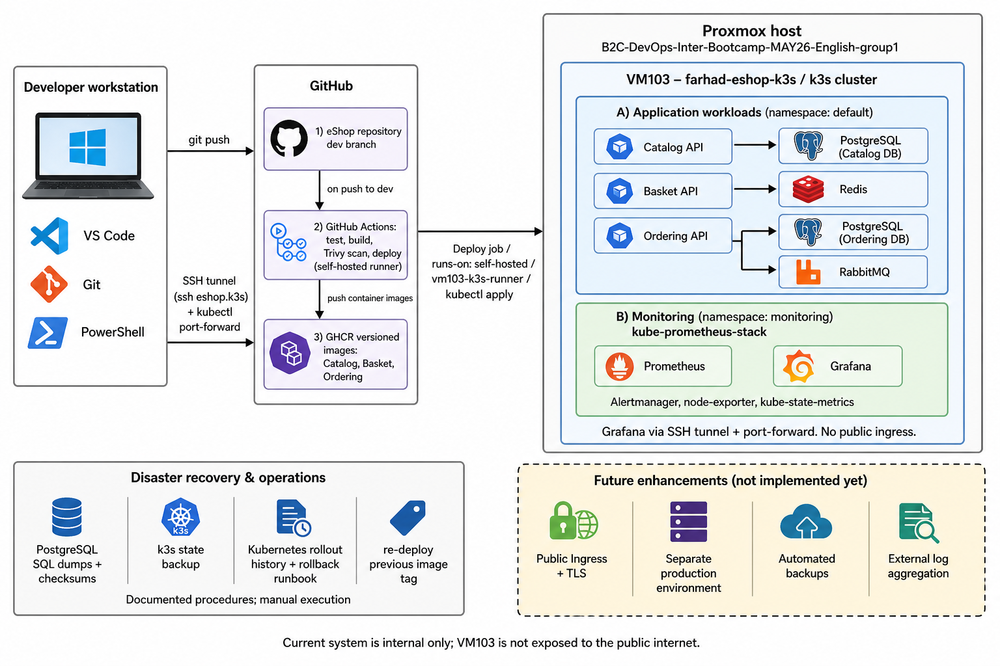

# eShop DevOps Project

A DevOps engineering graduation project built around Microsoft's [dotnet/eShop](https://github.com/dotnet/eShop) reference application. It demonstrates containerization, Kubernetes on k3s, CI/CD, Proxmox infrastructure, monitoring, and disaster-recovery documentation for a real microservices system.

## Overview

In-scope services:

- **Catalog.API** — product catalog (PostgreSQL / pgvector)
- **Basket.API** — shopping cart (Redis, gRPC)
- **Ordering.API** — order processing (PostgreSQL / pgvector, RabbitMQ)

The upstream repository also contains Identity.API, WebApp, and background processors. They are not included in the current Kubernetes deployment scope.

Ordering.API uses a placeholder `Identity__Url` so the service can start without Identity.API. Token-protected authentication flows are not claimed as working in the current k3s deployment.

### Data stores and messaging

- PostgreSQL with pgvector: `catalog-db`, `ordering-db`
- Redis: basket data
- RabbitMQ: event bus

## Architecture

The diagram shows the **current implemented environment** on Proxmox. It does not represent an idealized production architecture.



Editable source: [docs/architecture/eshop-devops-architecture.drawio](docs/architecture/eshop-devops-architecture.drawio)

### What runs today

- Catalog API → PostgreSQL (Catalog DB)
- Basket API → Redis
- Ordering API → PostgreSQL (Ordering DB) and RabbitMQ

### Where it runs

- Proxmox node: `B2C-DevOps-Inter-Bootcamp-MAY26-English-group1`
- VM103: `farhad-eshop-k3s` / hostname `eshopk3s`
- VM103 private IP: `10.10.10.198` on `vmbr1`
- Kubernetes: single-node k3s control plane
- Application manifests: `k8s/`, namespace `default`
- Monitoring: `kube-prometheus-stack`, namespace `monitoring`

### How code becomes images

1. Code is pushed to `dev` or `main`.
2. GitHub Actions (`.github/workflows/ci-cd.yml`) runs Basket and Ordering unit tests.
3. On pushes, GitHub Actions builds Catalog, Basket, and Ordering Docker images and pushes them to GHCR with `:latest` and `:<commit-sha>` tags.
4. Kubernetes manifests in `k8s/` are applied on VM103 using `kubectl`.
5. A private Traefik Ingress routes HTTP API traffic on VM103, but there is no public DNS, TLS, or public internet exposure.

### How the environment is accessed

- SSH jump access: `ssh eshop-k3s`
- Grafana and Prometheus: SSH plus `kubectl port-forward`
- Private API gateway routes: `/catalog`, `/basket`, and `/ordering` through Traefik on `10.10.10.198:80`
- Verified Catalog and Ordering endpoints:
  - `/catalog/health`
  - `/ordering/health`
  - `/catalog/api/catalog/items?api-version=1.0&pageSize=2`
- VM103 has no public IP, public DNS name, or TLS configuration. Access from outside the private network uses SSH/jump-host access.

### Future enhancements (not implemented)

- Public DNS, Ingress hardening, and TLS certificates
- Separate production environment with deployment approval gates
- Automated database / cluster backup jobs and restore tests
- External centralized logging (for example Loki or ELK)
- Kubernetes deployment of the WebApp storefront

More detail: [Proxmox infrastructure](docs/proxmox-infrastructure.md) and [Dockerization guide](docs/dockerization.md).

## Tech Stack

| Layer | Technology |
|---|---|
| Application | .NET 10, Microsoft eShop reference application |
| APIs in k3s scope | Catalog.API, Basket.API, Ordering.API |
| Databases | PostgreSQL with pgvector |
| Cache | Redis 7 |
| Messaging | RabbitMQ 4 Management |
| Containers | Dockerfiles, Docker Compose, GHCR |
| Kubernetes | k3s single-node cluster on VM103 |
| Ingress | Traefik (private HTTP routing) |
| CI | GitHub Actions |
| Monitoring | kube-prometheus-stack: Prometheus, Grafana, Alertmanager, kube-state-metrics, node-exporter |
| Local orchestration | .NET Aspire |
| Testing | .NET unit tests and Playwright files |
| Access | SSH ProxyJump and `kubectl port-forward` |

## Repository Map

| Path | Purpose |
|---|---|
| `src/` | eShop source code, services, and Dockerfiles |
| `tests/` | Unit and functional test projects |
| `k8s/` | Kubernetes Deployments, Services, configuration, infrastructure, and Ingress-related manifests |
| `docker-compose.yml` | Local/dev-style container stack |
| `docker-compose.prod.yml` | Production-like Docker Compose override |
| `.github/workflows/ci-cd.yml` | Project CI workflow: unit tests, Docker builds, GHCR pushes |
| `docs/architecture/` | Architecture PNG and editable Draw.io source |
| `docs/dockerization.md` | Dockerfile, Compose, verification, and troubleshooting guide |
| `docs/proxmox-infrastructure.md` | Proxmox networking, DHCP/NAT, VM103, and SSH documentation |
| `docs/disaster-recovery/` | Disaster recovery and rollback documentation |
| `evidence/card-29-rollback/` | Kubernetes rollback evidence screenshots |
| `docs/screenshots/` | Local Aspire and application evidence |

## Local Development with .NET Aspire

**Prerequisites:**

- .NET 10 SDK
- Docker Desktop running

Run from the repository root:

```bash
cd src/eShop.AppHost
dotnet run
```

The Aspire Dashboard displays service status, dependencies, logs, and endpoint links. Local evidence is available in `docs/screenshots/`.

## Docker Compose

The local Docker Compose environment runs the three core APIs with PostgreSQL, Redis, and RabbitMQ. See the [Dockerization Guide](docs/dockerization.md) for Dockerfile design, dependency analysis, verification, and troubleshooting.

| Aspect | Development | Production-like Compose |
|---|---|---|
| Configuration | `.env.development` (committed) | `.env.production` (not committed; see `.env.production.example`) |
| Environment | `Development` | `Production` |
| Database and RabbitMQ ports | Exposed on host for debugging | Internal Docker network only |
| Restart policy | Manual | `unless-stopped` |

Start the development environment:

```bash
docker compose --env-file .env.development up --build -d
```

Start the production-like Compose environment:

```bash
docker compose --env-file .env.production -f docker-compose.yml -f docker-compose.prod.yml up --build -d
```

Basic local checks:

```bash
curl "http://localhost:8080/api/catalog/items?api-version=1.0&pageSize=5"
curl -i "http://localhost:8082/health"
```

Basket.API is a gRPC service on local port `8081`; an HTTP/1 `curl` response is not a valid Basket API functional test.

## Kubernetes Deployment on VM103

VM103 (`farhad-eshop-k3s`) runs a private single-node k3s cluster. The node is `Ready` and uses private address `10.10.10.198`.

Current application deployments in namespace `default`:

- `catalog-api`
- `basket-api`
- `ordering-api`
- `catalog-db`
- `ordering-db`
- `redis`
- `rabbitmq`

Manifest files:

- `k8s/infra.yaml` — catalog database, ordering database, Redis, RabbitMQ
- `k8s/catalog-api.yaml` and `k8s/catalog-api-config.yaml`
- `k8s/basket-api.yaml` and `k8s/basket-api-config.yaml`
- `k8s/ordering-api.yaml` and `k8s/ordering-api-config.yaml`

The API workloads currently pull images from:

```text
ghcr.io/farhad-mm/eshop-devops-project/catalog-api:latest
ghcr.io/farhad-mm/eshop-devops-project/basket-api:latest
ghcr.io/farhad-mm/eshop-devops-project/ordering-api:latest
```

The current Traefik Ingress is private and routes:

```text
/catalog  → catalog-api:8080
/basket   → basket-api:8080
/ordering → ordering-api:8080
```

Do not expose VM103 or the Traefik service to the public internet without a dedicated hardening plan, firewall policy, DNS, and TLS configuration.

## CI/CD

Workflow: [`.github/workflows/ci-cd.yml`](.github/workflows/ci-cd.yml)

### Triggers

- Push to `dev` or `main`
- Pull requests targeting `main`

### Current jobs

| Job | Runs when | Purpose |
|---|---|---|
| `build-and-test` | Push and pull request | Restores and tests Basket.UnitTests and Ordering.UnitTests using .NET 10 |
| `docker-build-push` | Push only | Builds and pushes Catalog, Basket, and Ordering images to GHCR |
| `deploy` | Push only, after image build | Runs on the VM103 self-hosted runner, applies Kubernetes manifests, waits for API rollouts, and performs in-cluster smoke tests |

Each API image is pushed with:

```text
:latest
:<github-commit-sha>
```

### Current CI/CD scope

The implemented workflow provides tests, container build, GHCR publishing, image vulnerability scanning, and automated deployment to the private VM103 k3s cluster.

Implemented controls:

- Trivy scans commit-specific Catalog, Basket, and Ordering images for HIGH and CRITICAL known vulnerabilities.
- Gitleaks runs in a separate GitHub Actions workflow and scans repository files plus complete Git history for accidentally committed secrets.
- The `deploy` job runs on `vm103-k3s-runner`.
- The deploy job applies manifests in `k8s/`, waits for Catalog, Basket, and Ordering rollouts, and runs in-cluster health smoke tests.
- A workflow fails if a required test, rollout, or smoke test fails.

Current limitations:

- Trivy runs in reporting mode, so findings do not currently block deployment.
- No automated dependency-update workflow is configured.
- No GitHub Environment approval gate is configured.
- The WebApp/storefront is not deployed to k3s through this pipeline.

For full workflow and verification details, see [CI/CD documentation](docs/cicd-as-is.md).

## Monitoring

The `kube-prometheus-stack` Helm chart is deployed in the `monitoring` namespace.

Installed monitoring components:

- Prometheus
- Grafana
- Alertmanager
- Prometheus Operator
- kube-state-metrics
- node-exporter

Helm releases verified on VM103:

```text
monitoring   monitoring   kube-prometheus-stack
traefik      kube-system  traefik
traefik-crd  kube-system  traefik-crd
```

Prometheus collects Kubernetes, node, pod, workload, CPU, and memory metrics. Grafana provides dashboards and is accessed securely through SSH plus `kubectl port-forward`; it is not exposed publicly.

For monitoring components, private access, dashboards, and current limitations, see [Monitoring documentation](docs/monitoring-as-is.md).

## Security

Current security scope:

- GitHub Actions uses `GITHUB_TOKEN` to authenticate to GHCR.
- Project repository includes a `secrets-scan.yml` workflow inherited from the upstream template.
- SSH access uses keys and ProxyJump through the Proxmox host.
- Application services and data stores are private Kubernetes `ClusterIP` Services.
- Traefik is private on VM103; public DNS and TLS are not configured.
- `k8s/infra.yaml` contains **development-only** database and RabbitMQ values. Those values must not be used for production.
- Production credentials should be stored in Kubernetes Secrets or another dedicated secret-management solution before public/production deployment.

For implemented security controls, Trivy/Gitleaks behaviour, and current hardening gaps, see [Security documentation](docs/security-as-is.md).

## Proxmox Infrastructure and SSH

See [docs/proxmox-infrastructure.md](docs/proxmox-infrastructure.md) for the networking troubleshooting runbook and configuration details.

Key facts:

- Proxmox node: `B2C-DevOps-Inter-Bootcamp-MAY26-English-group1`
- VM network: `vmbr1`, subnet `10.10.10.0/24`
- NAT egress: `vmbr0`
- VM103 address reservation: `10.10.10.198`
- DHCP: dnsmasq scoped to `vmbr1`
- SSH command: `ssh eshop-k3s`
- VM103 resources: 4 CPU cores and 8 GB RAM

## Disaster Recovery

- Network and VM recovery runbook: [docs/proxmox-infrastructure.md](docs/proxmox-infrastructure.md)
- Backup strategy and verification: Card 28 covers k3s state, PostgreSQL logical dumps, repository configuration, and VM-level recovery.
- Kubernetes rollback procedure: [Card 29 rollback procedure](docs/disaster-recovery/card-29-rollback-procedure.md)
- Container and node recovery procedure: [Card 32 recovery runbook](docs/disaster-recovery/card-32-container-node-recovery.md)
- Rollback evidence: `evidence/card-29-rollback/`

The preferred application rollback method is to redeploy a known-good image version from Git/GHCR. An emergency `kubectl rollout undo` method is documented and was tested as a dry run for Catalog, Basket, and Ordering workloads.

For runtime pod and node failures, Card 32 documents diagnosis, Kubernetes self-healing, controlled Deployment restart, rollout verification, and private API health checks.

Database dumps, k3s state backups, and SHA256 integrity checks are part of the wider project recovery plan. Automated backup scheduling and restore testing remain future improvements.

## Committee Demo Scope

The live Kubernetes demonstration follows the [K3s deployment and committee demo access guide](docs/k3s-deployment-and-demo-access.md) and shows:

1. VM103 k3s cluster health and all running pods.
2. Private Traefik routing for Catalog, Basket, and Ordering APIs.
3. Catalog and Ordering health checks through the private Ingress.
4. Live Catalog API data.
5. Prometheus/Grafana monitoring through SSH and port-forward.
6. GitHub Actions test/build workflow and GHCR images.
7. Kubernetes rollback documentation and evidence.

The eShop WebApp/storefront has been demonstrated locally through .NET Aspire and Docker Compose. It is not currently deployed as a Kubernetes workload on VM103, so the committee demo will not claim that it is served from the k3s cluster.

## Acknowledgements

This project is built on Microsoft's [dotnet/eShop](https://github.com/dotnet/eShop) reference application. Sample catalog data is fictional and originates from the upstream reference project.