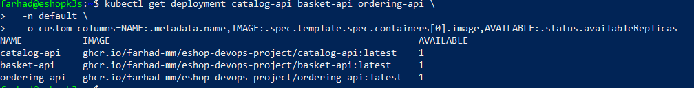
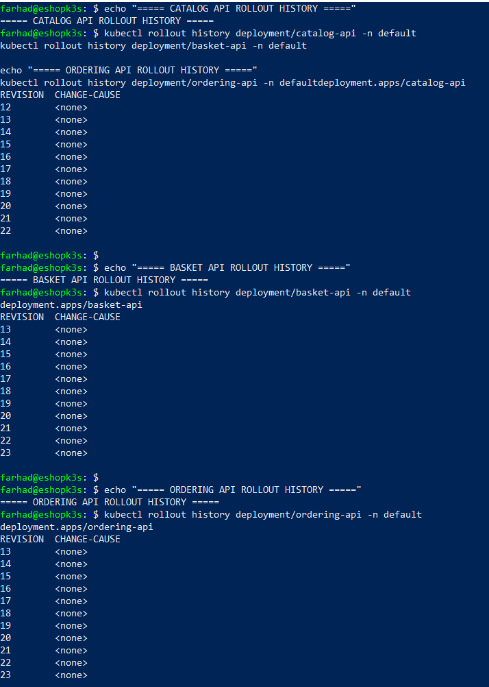
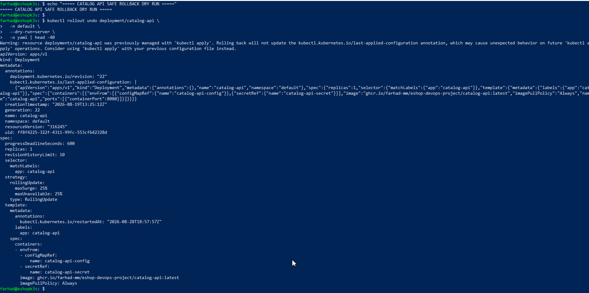

# Card 29 — Kubernetes Deployment Rollback Procedure

## Purpose

This document explains how to recover the eShop application if a new application deployment has a problem.

It applies to these Kubernetes Deployments in the `default` namespace:

- `catalog-api`
- `basket-api`
- `ordering-api`

The goal is to return an affected API to a previously working version while keeping Git and the CI/CD pipeline as the normal source of truth.

## Simple rollback concept

A rollback means returning an application from a newer, problematic release to an earlier working release.

Kubernetes stores recent Deployment revisions. This provides an emergency rollback option. The normal project recovery method should remain Git and GitHub Actions: select a known-good application image, update the Git-tracked manifest, commit the change, and let CI/CD deploy it.

## Rollback readiness verification

The following checks were performed on VM103 (`eshopk3s`) without changing the running application.

### Current deployment health

```bash
kubectl get deployment catalog-api basket-api ordering-api \
  -n default \
  -o custom-columns=NAME:.metadata.name,IMAGE:.spec.template.spec.containers[0].image,AVAILABLE:.status.availableReplicas
```

Result: Catalog API, Basket API, and Ordering API each had one available replica.

Evidence:



### Deployment rollout history

```bash
kubectl rollout history deployment/catalog-api -n default
kubectl rollout history deployment/basket-api -n default
kubectl rollout history deployment/ordering-api -n default
```

Verified rollout revisions:

| Deployment | Revisions observed |
|---|---|
| `catalog-api` | 12–22 |
| `basket-api` | 13–23 |
| `ordering-api` | 13–23 |

The Deployment configuration reports:

```text
revisionHistoryLimit: 10
```

`CHANGE-CAUSE` displayed `<none>`, which is not an error. It means earlier deployments did not save a human-readable change description in Kubernetes metadata.

Evidence:



### Safe rollback dry run

A rollback command was validated with Kubernetes using server-side dry-run mode:

```bash
kubectl rollout undo deployment/catalog-api \
  -n default \
  --dry-run=server \
  -o yaml | head -40
```

This checked that Kubernetes accepted the rollback request without changing, restarting, deleting, or redeploying the live Catalog API.

Evidence:



## Important limitation: `latest` image tags

The three current API manifests use mutable `latest` image tags:

```text
ghcr.io/farhad-mm/eshop-devops-project/catalog-api:latest
ghcr.io/farhad-mm/eshop-devops-project/basket-api:latest
ghcr.io/farhad-mm/eshop-devops-project/ordering-api:latest
```

A Kubernetes revision rollback may not fully restore an older application version when both the earlier and newer Deployment revisions refer to `:latest`. The tag can point to a newly pushed image.

The GitHub Actions workflow also publishes immutable, traceable image tags using the Git commit SHA:

```text
ghcr.io/${{ github.repository }}/catalog-api:${{ github.sha }}
ghcr.io/${{ github.repository }}/basket-api:${{ github.sha }}
ghcr.io/${{ github.repository }}/ordering-api:${{ github.sha }}
```

For a future production-style release process, manifests should use the known-good commit-SHA image tag rather than only `latest`.

## Normal rollback procedure

Use this method when the CI/CD pipeline is available.

1. Identify the affected service: `catalog-api`, `basket-api`, or `ordering-api`.
2. In GitHub Actions, identify the last known-good successful workflow run.
3. Record the commit SHA from that successful run.
4. Update the affected Kubernetes manifest in Git to use the corresponding known-good image tag.
5. Commit and push the rollback change to the `dev` branch.
6. Allow the existing CI/CD workflow to deploy the selected image.
7. Confirm the GitHub Actions deployment, rollout, and smoke-test steps succeed.
8. Verify the Deployment and pods on VM103.
9. Confirm Grafana shows the expected available replica and no abnormal restart increase.

Example image format only:

```yaml
image: ghcr.io/farhad-mm/eshop-devops-project/catalog-api:<known-good-commit-SHA>
```

Replace `<known-good-commit-SHA>` with the exact SHA from a verified successful workflow run.

## Emergency Kubernetes rollback

Use this only when urgent service recovery is required and the CI/CD pipeline cannot be used.

### Previous revision

```bash
kubectl rollout undo deployment/catalog-api -n default
```

### Specific revision

```bash
kubectl rollout history deployment/catalog-api -n default

kubectl rollout undo deployment/catalog-api \
  -n default \
  --to-revision=<revision-number>
```

### Verify recovery

```bash
kubectl rollout status deployment/catalog-api -n default --timeout=120s
kubectl get deployment catalog-api -n default
kubectl get pods -n default -l app=catalog-api
```

After an emergency rollback, update the Git-tracked Kubernetes manifest to the correct known-good image and push the reconciliation through the normal CI/CD process. This keeps Git aligned with the running cluster.

## Database recovery boundary

An application Deployment rollback changes the application container version. It does not restore PostgreSQL data, undo database migrations, restore ConfigMaps or Secrets, or recover deleted persistent data.

If data or schema recovery is required, use the separate Card 28 backup procedure and obtain approval before restoring persistent data.

## Evidence summary

| Evidence file | Purpose |
|---|---|
| `01-current-deployments.png` | Confirms the three APIs were healthy before rollback validation |
| `02-rollout-history.png` | Confirms previous Kubernetes Deployment revisions were retained |
| `03-rollback-dry-run.png` | Confirms rollback syntax was validated without changing the live application |

## Conclusion

Card 29 is complete: rollback readiness was verified safely, previous Deployment revisions were documented, the mutable `latest` tag limitation was identified, and both normal CI/CD-based rollback and emergency Kubernetes rollback procedures were documented.

